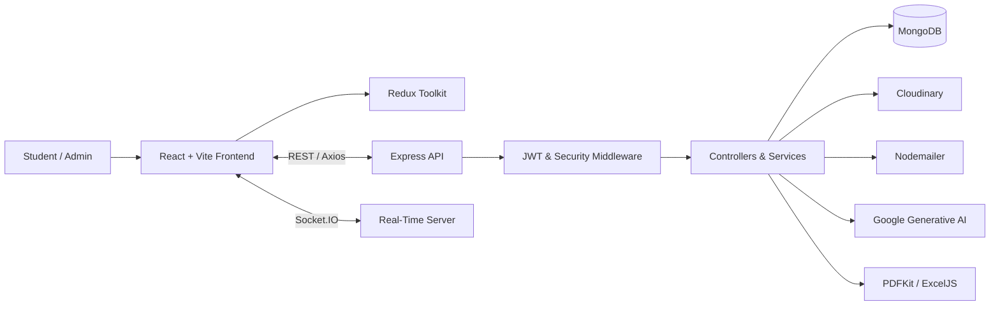

<div align="center">

# 🎓 Student Management System

### Full-Stack MERN Learning Management Platform

_Manage academics. Connect communities. Turn educational data into action._

[](https://www.mongodb.com/)
[](https://expressjs.com/)
[](https://react.dev/)
[](https://nodejs.org/)
[](https://www.typescriptlang.org/)

</div>

---

## 📖 About the Project

The **Student Management System** is a full-stack academic and learning-management platform developed with the MERN stack and TypeScript. It brings students, courses, assignments, notices, reports, uploads, notifications, and administrative workflows together in one scalable application.

The platform combines a responsive React dashboard with a RESTful Express API, MongoDB persistence, JWT-based authentication, real-time Socket.IO communication, cloud file management, automated email, report exports, and Google Generative AI features.

## 🧭 Quick Navigation

- [Key Features](#-key-features)
- [Technology Stack](#%EF%B8%8F-technology-stack)
- [System Architecture](#%EF%B8%8F-system-architecture)
- [Project Structure](#-project-structure)
- [Getting Started](#-getting-started)
- [Environment Variables](#-environment-variables)
- [API Overview](#-api-overview)
- [Available Scripts](#-available-scripts)
- [Docker](#-docker)
- [Troubleshooting](#-troubleshooting)

## ✨ Key Features

| Module | Capabilities |
| --- | --- |
| 🔐 Authentication | JWT-based sign-in, protected APIs, password hashing, and authorization |
| 👨‍🎓 Student Management | Manage student profiles and academic information |
| 📚 Academics | Organize courses and related academic workflows |
| 📝 Assignments | Create, manage, and monitor assignments |
| 📢 Notices | Publish and manage announcements |
| 🤖 AI Assistance | Google Generative AI-powered application features |
| 📊 Reporting | Generate academic reports and operational summaries |
| 📄 Data Export | Export reports as PDF and Excel workbooks |
| ☁️ File Uploads | Process uploads with Multer and Cloudinary |
| 📧 Email | Deliver notifications through Nodemailer |
| ⚡ Real-Time Updates | Communicate through Socket.IO and Socket.IO Client |
| 📱 Responsive Interface | Modern dashboards for desktop and mobile screens |

## 🛠️ Technology Stack

| Area | Technologies |
| --- | --- |
| Frontend | React 19, TypeScript 5.4, Vite 5 |
| UI | Tailwind CSS, Lucide React, Framer Motion, React Hot Toast |
| Routing & Forms | React Router 6, React Hook Form, Zod |
| State & Data | Redux Toolkit, React Redux, Axios |
| Visualization | Recharts |
| Backend | Node.js, Express 4.19, TypeScript, TSX |
| Database | MongoDB, Mongoose 8.4 |
| Security | JWT, bcryptjs, Helmet, CORS, Express Validator |
| Integrations | Cloudinary, Nodemailer, Google Generative AI |
| Reports | PDFKit, ExcelJS |
| Real-Time | Socket.IO 4.7 |
| Deployment | Docker |

## 🏗️ System Architecture



## 📁 Project Structure

```text
Student_management_system_mern-main/
├── backend/
│   ├── src/
│   │   ├── config/        # Database and integration configuration
│   │   ├── controllers/   # HTTP request handlers
│   │   ├── middleware/    # Authentication, validation, and errors
│   │   ├── models/        # Mongoose data models
│   │   ├── routes/        # REST API routes
│   │   ├── seeders/       # Initial development data
│   │   ├── services/      # Business and integration services
│   │   ├── socket/        # Real-time communication
│   │   ├── types/         # Backend TypeScript types
│   │   ├── app.ts         # Express application
│   │   └── server.ts      # Server entry point
│   ├── Dockerfile
│   ├── package.json
│   └── tsconfig.json
├── frontend/
│   ├── src/
│   │   ├── components/    # Reusable UI components
│   │   ├── layouts/       # Application layouts
│   │   ├── pages/         # Route-level screens
│   │   ├── redux/         # Store, slices, and async state
│   │   ├── services/      # API and client-side services
│   │   └── main.tsx       # React entry point and routing
│   ├── Dockerfile
│   ├── package.json
│   ├── tailwind.config.js
│   └── vite.config.ts
└── README.md
```

## 🚀 Getting Started

### Prerequisites

- Node.js 20 or later
- npm
- MongoDB local installation or MongoDB Atlas database
- Git
- Optional Cloudinary, SMTP, and Google AI accounts for integrations

### 1. Clone the Repository

```bash
git clone https://github.com/jayanidissanayake15/Student_management_system_mern-main.git
cd Student_management_system_mern-main
```

### 2. Install Backend Dependencies

```bash
cd backend
npm install
```

### 3. Configure Backend Environment

Create `backend/.env` and provide the required configuration described below.

### 4. Start the Backend

```bash
npm run dev
```

The development API uses port `5003` when `PORT=5003` is configured.

### 5. Install and Start the Frontend

Open a second terminal from the repository root:

```bash
cd frontend
npm install
npm run dev
```

Vite will display the local frontend URL in the terminal.

## 🔧 Environment Variables

Example `backend/.env` structure:

```env
PORT=5003
MONGODB_URI=your_mongodb_connection_string
JWT_SECRET=replace_with_a_long_random_secret

CLOUDINARY_CLOUD_NAME=your_cloud_name
CLOUDINARY_API_KEY=your_cloudinary_api_key
CLOUDINARY_API_SECRET=your_cloudinary_api_secret

EMAIL_USER=your_email_address
EMAIL_PASSWORD=your_email_app_password

GOOGLE_API_KEY=your_google_ai_api_key
```

> [!IMPORTANT]
> Never commit `.env`, database credentials, JWT secrets, email passwords, cloud secrets, or AI API keys to GitHub.

## 🔌 API Overview

| Base Route | Purpose |
| --- | --- |
| `/api/auth` | Authentication and user access |
| `/api/academic` | Academic and course management |
| `/api/assignments` | Assignment workflows |
| `/api/ai` | AI-assisted operations |
| `/api/reports` | Report and export generation |
| `/api/notices` | Notice and announcement management |
| `/health` | Server health status |

## 📜 Available Scripts

### Backend

| Command | Purpose |
| --- | --- |
| `npm run dev` | Run the TypeScript server with hot reload |
| `npm run build` | Compile TypeScript into `dist/` |
| `npm start` | Run the compiled production server |

### Frontend

| Command | Purpose |
| --- | --- |
| `npm run dev` | Start the Vite development server |
| `npm run build` | Type-check and create a production build |
| `npm run preview` | Preview the production build |
| `npm run lint` | Run ESLint checks |

## 🔒 Security

- JWT is used for protected API access.
- Passwords are hashed using bcryptjs.
- Helmet adds common HTTP security headers.
- CORS controls allowed cross-origin access.
- Express Validator validates incoming backend requests.
- Zod validates supported frontend forms.

For production, use HTTPS, restrict CORS origins, configure secure token expiration, validate uploads, and store secrets using the deployment platform's secret manager.

## 🐳 Docker

Build the backend and frontend images from the repository root:

```bash
docker build -t sms-backend ./backend
docker build -t sms-frontend ./frontend
```

Run the services with the required environment configuration and network access to MongoDB.

## 📦 Production Build

### Backend

```bash
cd backend
npm run build
npm start
```

### Frontend

```bash
cd frontend
npm run build
npm run preview
```

## 🧰 Troubleshooting

| Problem | Suggested Fix |
| --- | --- |
| MongoDB connection fails | Confirm `MONGODB_URI`, network access, and Atlas IP permissions |
| Backend does not start | Verify Node.js version, `.env` values, and whether port `5003` is available |
| Frontend cannot reach API | Check the Axios base URL, backend port, and CORS configuration |
| Login returns unauthorized | Verify the user credentials, JWT secret, and token expiration |
| File upload fails | Check Cloudinary credentials, upload validation, and file limits |
| Email does not send | Verify SMTP credentials and use an app password where required |
| AI feature returns an error | Confirm the Google API key, enabled service, and provider limits |
| Socket connection fails | Confirm both apps use compatible URLs and Socket.IO versions |

## 👩‍💻 Author

<div align="center">

### Jayani Dissanayake

Full Stack Developer · Computer Science Undergraduate

[](https://github.com/jayanidissanayake15)
[](https://www.linkedin.com/in/jayani-dissanayake-9b564a253)

</div>

## 📄 License

This repository currently does not include a license file. Add a suitable license before distributing the project or accepting external contributions.

---

<div align="center">

**⭐ If this project helps you, consider giving the repository a star.**

Built with the MERN stack and TypeScript.

</div>
